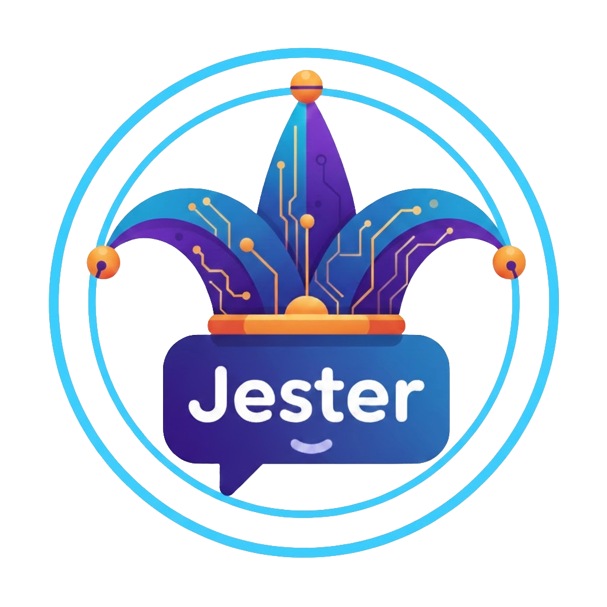

# Jester -- AI Concierge for Las Vegas Hotels

Jester is a character-driven AI customer service chatbot built for Las Vegas hotels. Rather than replacing a property's theatrical identity with a generic support widget, Jester *becomes* the brand — each hotel gets its own persona, voice, and knowledge base, grounded in real property information to prevent hallucination.

| Hotel | Character | Personality |
|---|---|---|
| Caesars Palace | Julius | Regal Roman imperial attendant |
| Luxor | Amara | Mystical Egyptian oracle |
| Santa Fe Station | Rosa | Warm, friendly neighborhood local |
| Treasure Island | Captain Morgan | Swashbuckling pirate captain |
| Excalibur | Sir Roland | Honorable Arthurian knight |

Characters stay in persona throughout the conversation, answer questions using property-specific RAG knowledge, support image uploads for multi-modal queries, and can detect or be explicitly told to escalate to a human agent.

---

## Architecture

```
frontend/          React + TypeScript (Vite)
backend/
  routers/         FastAPI route handlers
  pipeline/
    themes.py      Per-hotel persona definitions
    prompt.py      Prompt construction + context management
    featherless.py Featherless.ai API client + <think> tag filtering
    rag.py         ChromaDB retrieval
  data/
    knowledge_base/  Per-property .md knowledge files
  scripts/
    ingest.py      Chunks and embeds knowledge base into ChromaDB
```

**Key technologies:**
- **Frontend:** React, TypeScript, Vite
- **Backend:** Python, FastAPI, Server-Sent Events (streaming)
- **LLM API:** [Featherless.ai](https://featherless.ai) (Qwen 72B by default, vision model for image queries)
- **RAG:** ChromaDB + ONNXMiniLM_L6_V2 embeddings
- **Hosting:** Render (backend as web service, frontend as static site)

---

## Prerequisites

- Node.js 18+
- Python 3.10+
- A [Featherless.ai](https://featherless.ai) API key

---

## Local Setup

### 1. Clone the repo

```bash
git clone https://github.com/your-username/jester.git
cd jester
```

---

### 2. Backend

#### Install dependencies

```bash
cd backend
python -m venv venv
source venv/bin/activate        # Windows: venv\Scripts\activate
pip install -r requirements.txt
```

#### Configure environment variables

Create a `.env` file in the `backend/` directory:

```env
FEATHERLESS_API_KEY=your_api_key_here
DEFAULT_MODEL=Qwen/Qwen2.5-72B-Instruct
FALLBACK_MODEL=Qwen/Qwen2.5-32B-Instruct
VISION_MODEL=Qwen/Qwen2.5-VL-72B-Instruct
```

#### Ingest the knowledge base

This only needs to be run once (or whenever you update the `.md` files in `data/knowledge_base/`):

```bash
python scripts/ingest.py
```

This chunks each hotel's knowledge file and loads the embeddings into ChromaDB.

#### Start the backend server

```bash
uvicorn main:app --reload --port 8000
```

The API will be available at `http://localhost:8000`.

---

### 3. Frontend

#### Install dependencies

```bash
cd ../frontend
npm install
```

#### Configure environment variables

Create a `.env` file in the `frontend/` directory:

```env
VITE_API_URL=http://localhost:8000
```

#### Start the dev server

```bash
npm run dev
```

The app will be available at `http://localhost:5173`.

---

## Running Both Together

From the project root you can open two terminals:

```bash
# Terminal 1 — backend
cd backend && source venv/bin/activate && uvicorn main:app --reload --port 8000

# Terminal 2 — frontend
cd frontend && npm run dev
```

---

## Knowledge Base

Each hotel has a dedicated Markdown file in `backend/data/knowledge_base/`:

```
caesars_palace.md
luxor.md
santa_fe_station.md
treasure_island.md
excalibur.md
```

These files contain property-specific information — shows, restaurants, hours, amenities, loyalty programs, and more. When a guest asks a question, the RAG pipeline retrieves the most relevant chunks from the active hotel's knowledge base and injects them into the model's context so responses are grounded in real information rather than guesswork.

To update a hotel's knowledge, edit the relevant `.md` file and re-run:

```bash
python scripts/ingest.py
```

---

## Adding a New Hotel

1. **Define the persona** — add a new `Theme` entry to `backend/pipeline/themes.py` with the hotel's `company_name`, `persona_name`, `persona_description`, `tone`, `vocabulary`, `forbidden_words`, `greeting`, and `escalation_phrase`.

2. **Create the knowledge base** — add a `your_hotel.md` file to `backend/data/knowledge_base/` and re-run `python scripts/ingest.py`.

3. **Add the hotel to the frontend** — add a new entry to the `HOTELS` array in `frontend/src/App.tsx` with the matching `theme` key, colors, icon, and preset prompts.

---

## Environment Variables Reference

| Variable | Location | Description |
|---|---|---|
| `FEATHERLESS_API_KEY` | backend `.env` | Your Featherless.ai API key |
| `DEFAULT_MODEL` | backend `.env` | Primary text model (default: Qwen 72B) |
| `FALLBACK_MODEL` | backend `.env` | Fallback if primary fails (default: Qwen 32B) |
| `VISION_MODEL` | backend `.env` | Model used when image is attached |
| `VITE_API_URL` | frontend `.env` | Backend base URL |

---
